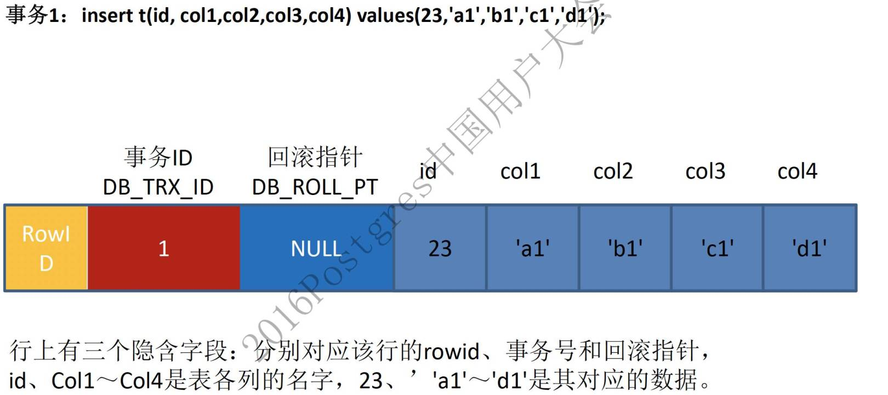
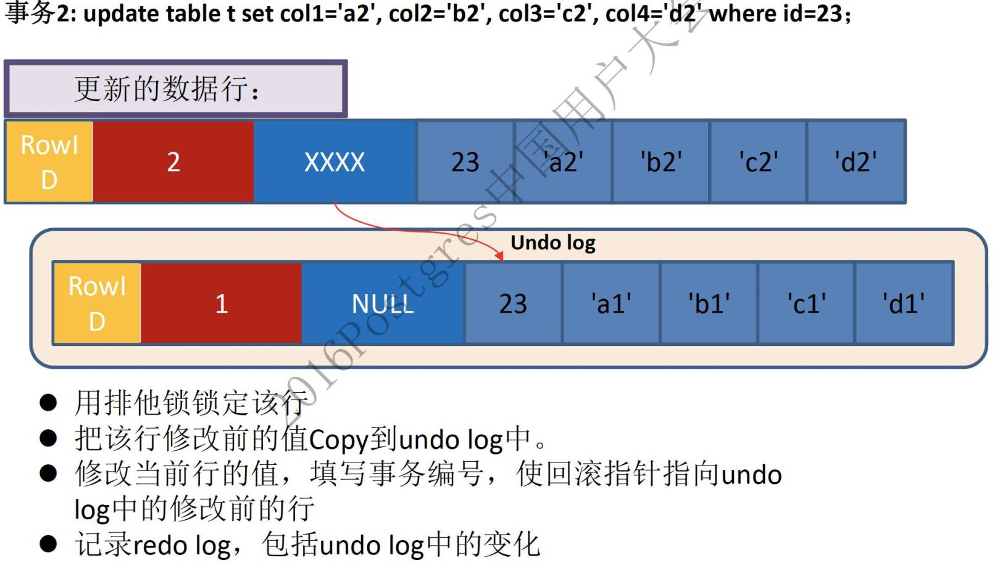

# Mysql

## Mysql基本架构


第一层：服务层(为客户端服务):为请求做连接处理，授权认证，安全等。
第二层：Mysql核心服务层：主要提供，查询解析、分析、优化、缓存以及内置函数，跨存储引擎功能（存储过程、视图、触发器）
第三层：存储引擎层，负责数据的存储和提取

## 如何保证不丢数据

双1模式

也就是说每次事务提交的时候，一次写log buffer，一次刷盘（写入redo log）

在提交事务之前，允许将binlog同步到磁盘。

## 日志区别

binlog：操作日志，用于回档

undo log：事务日志，事务开始前的数据，用于MVCC

redo log：重做日志，确保事务的持久性。防止在发生故障的时间点，尚有脏页未写入磁盘，在重启mysql服务的时候，根据redo log进行重做，从而达到事务的持久性这一特性。

redo log是InnoDB引擎特有的；binlog是MySQL的Server层实现的，所有引擎都可以使用。

redo log是物理日志，记录的是“在某个数据页上做了什么修改”；binlog是逻辑日志，记录的是这个语句的原始逻辑，比如“给ID=2这一行的c字段加1 ”。

redo log是循环写的，空间固定会用完；binlog是可以追加写入的。“追加写”是指binlog文件写到一定大小后会切换到下一个，并不会覆盖以前的日志。

## binlog和redolog一致性保证

xa：先让redo log prepare，后写binlog，后commit

##  ON、WHERE、HAVING的区别

ON、WHERE、HAVING的主要差别是其子句中限制条件起作用时机引起的，ON是在生产临时表之前根据条件筛选记录，WHERE是从生产的临时表中筛选数据，而HAVING是对临时表中满足条件的数据，进行计算分组之后，通过HAVING限制语句筛选分组，返回结果是满足HAVING子句限制的分组。

## 为什么要创建索引

索引是对数据库表中一个或多个列的值进行排序的数据结构，以协助快速查询、更新数据库表中数据。

## 索引的种类：

唯一索引	不允许任何两行具相同值
主键索引	唯一索引的一种
普通索引	无限制
全文索引	针对较大的数据生成全文索引很耗时间空间

## 增加索引也有许多不利的一个方面:

时间方面：创建索引和维护索引要耗费时间
空间方面：索引需要占物理空间。

## 索引有哪些？聚集索引和非聚集索引的区别？

FULLTEXT，HASH，BTREE，RTREE。

- 聚集索引就是以**主键**创建的索引
- 非聚集索引就是以**非主键**创建的索引

区别：

- 聚集索引在叶子节点存储的是**表中的数据**
- 非聚集索引在叶子节点存储的是**主键和索引列**
- 使用非聚集索引查询出数据时，**拿到叶子上的主键再去查到想要查找的数据**。(拿到主键再查找这个过程叫做**回表**)

## 索引规则


遇到范围查询(>、<、between、like、order by)就停止匹配

前导模糊查询不会使用索引：like '%李'

or左右都要有索引

负向条件（!=、<>、not in、not exists、not lik）不会使用索引，建议用in

## 为什么说B+-tree比B 树更适合实际应用中操作系统的文件索引和数据库索引？


B+tree的磁盘读写代价低：B+树的内部节点并没有指向关键字具体信息的指针，因此其内部节点相对B树更小；
B+tree的查询效率更加稳定；
B+树的数据都存储在叶子结点中，分支结点均为索引，方便扫库，只需要扫一遍叶子结点即可；

## 什么样的字段适合建索引

唯一、不为空、经常被查询，重复字段少的字段

## 什么情况下不宜建立索引？

对于查询中很少涉及的列或者重复值比较多的列，不宜建立索引。

## 几种数据库对比


es分页处理十分十分慢！

## 数据库引擎有哪些？InnoDB和MyIsam有啥区别?

MyISAM InnoDB MEMORY MERGE BDB；
MyISAM是非事务安全型的，而InnoDB是事务安全型的，
MyISAM锁的粒度是表级，而InnoDB支持行级锁定。
MyISAM相对简单，所以在效率上要优于InnoDB
MyISAM不支持外健，InnoDB支持。

## mysql实现事务的原理

通过redo 和 undo 日志文件实现的

## 数据库的事务特性（事务原理）

原子性：要么全部成功，要么全部失败回滚（undolog）	

隔离性：多个并发事务之间要相互隔离（锁）

持久性：持久性是指一个事务一旦被提交了，那么对数据库中的数据的改变就是永久性的（redolog）

一致性：一个一致性状态变换到另一个一致性状态（其他三个的附属品）

## 事务隔离级别

 1. 读未提交（Read Uncommitted）
    
    原理：任何操作都不加锁
    
 2. 读提交（Read Commit）

    原理：MVCC+快照读：每次select都生成一个快照读。因此会产生不可重复读

3. 可重复读（Reapable Read）

   原理：MVCC+快照读：开启事务执行第一个select的时候快照读，生成的快照是通过mvcc和undolog日志来实现的。

4. 串行化（Serializable）

   原理：读写锁或者Next-Key Lock

脏读：一个事务读取了另一个事务未提交的数据；
不可重复读：不可重复读的重点是修改，同样条件下两次读取结果不同，也就是说，被读取的数据可以被其它事务修改；
幻读：幻读的重点在于新增或者删除，同样条件下两次读出来的记录数不一样。

## MVCC(多版本并发控制)

借助MVCC，数据库可以实现RC，RR等隔离级别，用户可以查看当前数据的前一个或者前几个历史版本。保证了ACID中的I-隔离性。

上述现象在数据库中大家经常看到，但是数据库到底是怎么实现的，深究的人就不多了。  其实原理很简单，数据库就是通过UNDO和MVCC来实现的。

#### 1、通过DB_ROLL_PT 回溯查找数据历史版本

- 首先InnoDB每一行数据还有一个DB_ROLL_PT的回滚指针，用于指向该行修改前的上一个历史版本  



 当插入的是一条新数据时，记录上对应的回滚段指针为NULL



 更新记录时，原记录将被放入到undo表空间中，并通过DB_ROLL_PT指向该记录。session2查询返回的未修改数据就是从这个undo中返回的。MySQL就是根据记录上的回滚段指针及事务ID判断记录是否可见，如果不可见继续按照DB_ROLL_PT继续回溯查找。

## 快照读

session A会话会生成一个[94,96,97]的数组。这时候，session A一开始生成的事务数组就派上用场了，session A的事务数组是[94,96,97]，最小事务ID是94，最大事务ID是97，所以，当它遇到一行数据时，会先判断这行数据的版本号X：

- 如果X大于97，那么意味着这行数据，是在session A开始之后，才提交的，应该对session A不可见
- 如果X小于97，那么分两种情况：
- - 如果X在数组里面，比如X是96，那么意味着，当session A开始时，生成这个版本的数据的事务，还没提交，因此这行数据对Session A不可见
  - 如果X不在数组里面，比如X是95，那么意味着，当session A开始时，生成这个版本的数据的事务，已经提交，因此这行数据对Session A可见

简单的select操作(不包括 select … lock in share mode, select … for update)。

Read Committed隔离级别：每次select都生成一个快照读。因此会产生不可重复读

Read Repeatable隔离级别：**开启事务后第一个select语句才是快照读的地方，而不是一开启事务就快照读。**

## 当前读

读取的是记录数据的最新版本，并且当前读返回的记录都会加上锁，保证其他事务不会再并发的修改这条记录

## next-key锁(行记录锁+Gap间隙锁)

Select * from  emp where empid > 100 for update;

## RR级别 幻读例子

Mysql官方给出的幻读解释是：只要在一个事务中，第二次select多出了row就算幻读。
1.a事务先select，b事务insert确实会加一个gap锁，但是如果b事务commit，这个gap锁就会释放（释放后a事务可以随意dml操作），
2.a事务再select出来的结果在MVCC下还和第一次select一样，
3.接着a事务不加条件地update，这个update会作用在所有行上（包括b事务新加的），
4.a事务再次select就会出现b事务中的新行，并且这个新行已经被update修改了

原因是前面的UPDATE语句执行之后，会将当前记录上存储的事务信息更新为当前的事务，而当前事务所做的任何更新，对本事务所有SELECT查询都变的可见，因此最后输出的结果是UPDATE执行后更新的所有记录。

## 数据库锁


- 对于`UPDATE、DELETE、INSERT`语句，**InnoDB**会**自动**给涉及数据集加排他锁（X)

  **MyISAM**在执行查询语句`SELECT`前，会**自动**给涉及的所有表加**读锁**，在执行更新操作（`UPDATE、DELETE、INSERT`等）前，会**自动**给涉及的表加**写锁**，这个过程并**不需要用户干预**

- 共享锁（S）：`SELECT * FROM table_name WHERE ... LOCK IN SHARE MODE`。

- 排他锁（X）：`SELECT * FROM table_name WHERE ... FOR UPDATE`。

- 间隙锁  :SELECT c FROM t WHERE c BETWEEN 10 and 20 FOR UPDATE;

允许多个线程同时对想读的内容加锁,即共享锁或叫S锁),写的时候不*能*读

InnoDB实现的`Repeatable read`隔离级别配合GAP间隙锁已经避免了幻读！

- 乐观锁其实是一种思想，正如其名：认为不会锁定的情况下去更新数据，如果发现不对劲，才不更新(回滚)。在数据库中往往添加一个version字段来实现。
- 悲观锁用的就是数据库的行锁，认为数据库会发生并发冲突，直接上来就把数据锁住，其他事务不能修改，直至提交了当前事务

## 外连接

外连接：left join，right join

内连接：inner join（只显示满足条件的）

全连接：full join（满足的和不满足的都显示）

交叉连接：cross join（笛卡尔积）

## 表的范式的三大范式

第一范式（1NF）确保每列保持原子不可再分。
第二范式（2NF）属性完全依赖于主键：依赖于主键（联合主键）的一部分。
第三范式（3NF）属性不依赖于其它非主属性 ：依赖于非主键列。

## 查询前n名的sql语句

select a.s_id,a.c_id,a.s_score from score a 
where (select COUNT(1) from score b where b.c_id=a.c_id and b.s_score>=a.s_score)<=2 ORDER BY a.c_id

## limit 20000，10如何优化

SELECT id,title,content **FROM** items **WHERE** id IN (**SELECT** id **FROM** items **ORDER** **BY** id limit 900000, 10); 

## 一个 SQL 执行的很慢的原因

怎么发现有问题的SQL?（通过MySQL慢查询日志对有效率问题的SQL进行监控）

通过explain查询和分析SQL的执行计划

1、大多数情况下很正常，偶尔很慢，则有如下原因

(1)、数据库在刷新脏页，例如 redo log 写满了需要同步到磁盘。

(2)、执行的时候，遇到锁，如表锁、行锁。

2、这条 SQL 语句一直执行的很慢，则有如下原因。

(1)、没有用上索引：例如该字段没有索引；由于对字段进行运算、函数操作导致无法用索引。

(2)、数据库选错了索引。

## explain的type类型


## SQL优化

第一优化你的sql和索引；

第二加缓存，memcached,redis；

第三以上都做了后，还是慢，就做主从复制，读写分离

第四如果以上都做了，那就先做垂直拆分，其实就是根据你模块的耦合度，将一个大的系统分为多个小的系统，也就是分布式系统；

第五才是水平切分，针对数据量大的表，这一步最麻烦，最能考验技术水平，要选择一个合理的sharding key,为了有好的查询效率，表结构也要改动，做一定的冗余，应用也要改，sql中尽量带sharding key，将数据定位到限定的表上去查，而不是扫描全部的表；

## 读写分离

单节点转化为集群架构，提升数据库的并发读写性能。

主从复制原理：主库将变更写入 binlog 日志，然后从库连接到主库之后，从库有一个 IO 线程，将主库的 binlog 日志拷贝到自己本地，写入一个 relay 中继日志中。接着从库中有一个 SQL 线程会从中继日志读取 binlog，然后执行 binlog 日志中的内容，也就是在自己本地再次执行一遍 SQL，这样就可以保证自己跟主库的数据是一样的。

## 分库分表后的缺点

1、引入聚合函数的二次汇总

2、排序问题

3、连表查询问题：根据不同维度创建mysql表||查询条件不同用es||查询条件基本一样用hbase：rowkey。

4、跨节点的count,order by,group by以及聚合函数问题

5、数据迁移，容量规划，扩容等问题

6、ID问题

7、分库数量

## 分库分表如何迁移

阶段一：程序数据双写，读旧库，迁移历史数据。DBA在业务低峰期使用mysqldump或mydumper导出并导入数据

阶段二：程序数据双写，读旧库，新旧两库数据追平。

1. 根据sys_utime 导出最近变化的数据，进行数据修复，并通过数据比对工具核对数据
2. 多次重复第三步骤，直至新旧库数据一致

阶段三：程序双写，读新库，数据比对工具仍然继续比对，为程序回退做准备。

阶段四：观察一周，分库分表业务运行正常，停止对旧库进行写入，数据迁移完成。

## 免迁移扩容

采用双倍扩容策略，避免数据迁移。扩容前每个节点的数据，有一半要迁移至一个新增节点中，对应关系比较简单。
具体操作如下(假设已有 2 个节点 A/B，要双倍扩容至 A/A2/B/B2 这 4 个节点)：

无需停止应用服务器；
新增两个数据库 A2/B2 作为从库，设置主从同步关系为：A=>A2、B=>B2，直至主从数据同步完毕(早期数据可手工同步)；
调整分片规则并使之生效：
原 ID%2=0 => A 改为 ID%4=0 => A, ID%4=2 => A2；
原 ID%2=1 => B 改为 ID%4=1 => B, ID%4=3 => B2。
解除数据库实例的主从同步关系，并使之生效；
此时，四个节点的数据都已完整，只是有冗余(多存了和自己配对的节点的那部分数据)，择机清除即可(过后随时进行，不影响业务)。

## MySQL的delete,drop与truncate区别？

drop	表级的删除；
truncate	清空表；
delete	配合where删除数据；

## MySQL中varchar与char的区别以及varchar(50)中的50代表的涵义

#### (1)、varchar与char的区别

char是一种固定长度的类型，varchar则是一种可变长度的类型

#### (2)、varchar(50)中50的涵义

最多存放50个字符，varchar(50)和(200)存储hello所占空间一样，但后者在排序时会消耗更多内存，因为order by col采用fixed_length计算col长度(memory引擎也一样)

#### (3)、int（20）中20的涵义

是指显示字符的长度
但要加参数的，最大为255，比如它是记录行数的id,插入10笔资料，它就显示00000000001 ~~~00000000010，当字符的位数超过11,它也只显示11位，如果你没有加那个让它未满11位就前面加0的参数，它不会在前面加0
20表示最大显示宽度为20，但仍占4字节存储，存储范围不变；

## 有多少种日志?

错误日志：记录出错信息，也记录一些警告信息或者正确的信息。
查询日志：记录所有对数据库请求的信息，不论这些请求是否得到了正确的执行。
二进制日志：记录对数据库执行更改的所有操作。
慢查询日志：设置一个阈值，将运行时间超过该值的所有SQL语句都记录到慢查询的日志文件中。
事务日志：

## 存储过程和触发器

存储过程：类似创建一个方法，带有参数，储存多条sql语句，在sql中调用。

触发器：创建一个事件在指定的“频率”，当“增删改”的“之前或之后”去执行。

# Redis

## 什么是Redis？

Redis本质上是一个Key-Value类型的内存数据库,因为是纯内存操作，Redis的性能非常出色，每秒可以处理超过 10万次读写操作，是已知性能最快的Key-Value DB。

## Redis为什么这么快？

- **纯内存操作**
- **单线程**
- **高效的数据结构**
- **合理的数据编码**
- **其他方面的优化**

## Redis多线程的设计

Redis 的多线程部分只是用来处理网络数据的读写和协议解析，执行命令仍然是单线程。之所以这么设计是不想因为多线程而变得复杂，需要去控制 key、lua（一种轻量级脚本语言）、事务，LPUSH/LPOP（redis语法：将一个或多个值插入到列表头部（左边）、移出并获取列表的第一个元素(左边)） 等等的并发问题。

## Redis支持哪几种数据类型？ 

#### 3.1 字符串(string)

> 字符串编码有三个：int、raw、embstr。

##### 3.1.1 int

> 当string对象的值全部是数字，就会使用int编码。

```
127.0.0.1:6379> set number 123455
OK
127.0.0.1:6379> object encoding number
"int"
```

##### 3.1.2 embstr

> 字符串或浮点数长度小于等于39字节，就会使用embstr编码方式来存储，embstr存储内存一般很小，所以redis一次性分配且内存连续(效率高)。

```
127.0.0.1:6379> set shortStr "suwe suwe suwe"
OK
127.0.0.1:6379> object encoding shortStr
"embstr"
```

##### 3.1.2 raw

> 当一个字符串或浮点数长度大于39字节，就使用SDS来保存，编码为raw，由于不确定值的字节大小，所以键和值各分配各的，所以就分配两次内存(回收也是两次)，同理它一定不是内存连续的。

```
127.0.0.1:6379> set longStr "hello everyone, we dont need to sleep around to go aheard! do you think?"
OK
127.0.0.1:6379> object encoding longStr
"raw"
```

##### 3.1.3 编码转换

> 前面说过，Redis会自动对编码进行转换来适应和优化数据的存储。

int->raw

> 条件：数字对象进行append字母，就会发生转换。

```
127.0.0.1:6379> object encoding number
"int"
127.0.0.1:6379> append number " is a lucky number"
(integer) 24
127.0.0.1:6379> object encoding number
"raw"
```

embstr->raw

> 条件：对embstr进行修改，redis会先将其转换成raw，然后才进行修改。所以embstr实际上是只读性质的。

```
127.0.0.1:6379> object encoding shortStr
"embstr"
127.0.0.1:6379> append shortStr "(hhh"
(integer) 18
127.0.0.1:6379> object encoding shortStr
"raw"
```

#### 3.2 列表(list)

> 列表对象编码可以是：ziplist或linkedlist。

1. `ziplist`压缩列表不知道大家还记得不，就是`zlbytes zltail zllen entry1 entry2 ..end`结构,`entry节点`里有`pre-length、encoding、content`属性，忘记的可以返回去看下。
2. `linkedlist`,类似双向链表，也是上一章的知识。

##### 3.2.1 编码转换

ziplist->linkedlist

> 条件：列表对象的所有字符串元素的长度大于等于64字节 & 列表元素数大于等于512. 反之，小于64和小于512会使用ziplist而不是用linkedlist。

> 这个阈值是可以修改的，修改选项：`list-max-ziplist-value`和`list-max-ziplist-entriess```

#### 3.3 哈希(hash)

> 哈希对象的编码有:ziplist和hashtable

##### 3.3.1 编码转换

ziplist->hashtable

> 条件：哈希对象所有键和值字符串长度大于等于64字节 & 键值对数量大于等于512

> 这个阈值也是可以修改的，修改选项：`hash-max-ziplist-value`和`hash-max-ziplist-entriess```

#### 3.4. 集合(set)

> 集合对象的编码有：intset和hashtable

##### 3.4.1 intset

1. 集合对象所有元素都是整数
2. 集合对象元素数不超过512个

##### 3.4.2 编码转换

intset->hashtable

> 条件：元素不都是整数 & 元素数大于等于512

#### 3.5. 有序集合(zset)

> 有序集合用到的编码：ziplist和skiplist

使用跳表不使用红黑树原因

skiplist 虽然更耗内存（每个节点需要存储 level 指针），但是内存消耗不是很大
zset 一般使用 zrange 来进行范围查询，skiplist 的范围查询相比平衡树（红黑树）对 cache 更友好
实现简单

大家可能很好奇阿，ziplist的entry中只有属性content可以存放数据，集合也是`key-value`形式，那怎么存储呢?

> 第一个节点保存key、第二个节点保存value 以此类推...

##### 3.5.1 为什么要用这两个编码

1. 如果只用ziplist来实现，无法做到元素的排序，不支持范围查找，能做到元素的快速查找。
2. 如果只用skiplist来实现，无法做到快速查找，但能做到元素排序、范围操作。

##### 3.5.2 编码转换

ziplist->skiplist

> 条件：有序集合元素数 >= 128 & 含有元素的长度 >= 64

> 这个阈值也是可以修改的，修改选项：`zset-max-ziplist-value`和`zset-max-ziplist-entriess`

## Redis有哪几种数据淘汰策略？ 

noeviction:返回错误当内存限制达到并且客户端尝试执行会让更多内存被使用的命令（大部分的写入指令，但DEL和几个例外）
allkeys-lru: 尝试回收最少使用的键（LRU），使得新添加的数据有空间存放。
volatile-lru: 尝试回收最少使用的键（LRU），但仅限于在过期集合的键,使得新添加的数据有空间存放。
allkeys-random: 回收随机的键使得新添加的数据有空间存放。
volatile-random: 回收随机的键使得新添加的数据有空间存放，但仅限于在过期集合的键。
volatile-ttl: 回收在过期集合的键，并且优先回收存活时间（TTL）较短的键,使得新添加的数据有空间存放。

## 一个字符串类型的值能存储最大容量是多少**？** 

512M

## 为什么Redis需要把所有数据放到内存中 

Redis为了达到最快的读写速度将数据都读到内存中，并通过异步的方式将数据写入磁盘。
所以redis具有快速和数据持久化的特征。如果不将数据放在内存中，磁盘I/O速度为严重影响redis的性能。

## MySQL里有2000w数据，redis中只存20w的数据，如何保证redis中的数据都是热点数据？ 

redis内存数据集大小上升到一定大小的时候，就会施行数据淘汰策略。 

## **Redis**有哪些适合的场景**？**

（1）会话缓存（Session Cache）
（2）全页缓存（FPC）
（3）消息队列
Reids在内存存储引擎领域的一大优点是提供 list 和 set 操作，这使得Redis能作为一个很好的消息队列平台来使用。Redis作为队列使用的操作，就类似于本地程序语言（如Python）对 list 的 push/pop 操作。
（4）排行榜/计数器
（5）发布/订阅

## Redis发布订阅

对比List
与Redis中的List对比，基于List实现的消息队列需要结合lpush + brpop来实现。

胜（多消费组）：当多个客户端同时消费同一个List消息队列时，消费者A使用brpop消费的数据就从list中弹出了，消费者B就再也读不到该数据，而在发布订阅中，多个订阅者可以订阅相同的频道，频道内的数据会分发到各个订阅者，不会出现某一个订阅者消费了之后，另一个订阅者读不到该数据的情况。

负（断点消费）：但对于List的消息队列来说，当消费者断开后重连，仍然可以从List中断点消费还没消费的数据，而发布订阅中，如果订阅者断开重连，会丢失断开期间发布者发布的数据，无法恢复。

对比Kafka
Redis的发布订阅以及List并不是要和专业的消息队列对标，而是可以实现类似的功能

不同点：

持久化：Kafka会将数据持久化到磁盘内，而Redis的发布订阅做不到；

断点消费：上面也提到，当订阅者断开重连会丢失断开期间发布者发布的消息，而kafka中会记录每个消费者消费的topic的offset，因此kafka可以从断开的offset继续消费；

偏移量：基于上一条，同样的kafka的消费者可以指定从某个offset开始重新消费，而Redis发布订阅根本不会记录订阅者消费的偏移量； 

消费方式： 在Redis发布订阅中，数据消费情况是由发布者控制的，当发布者发布到频道中后，只有当前连接了频道的订阅者才能消费到数据，断开重连的会失去那部分数据。而kafka中消费进度是由消费者控制的，消费者从topic中拉取数据并记录消费的offset。

## 普通哈希

先对key进行哈希。得到哈希结果在取模。然后根据取模结果，去对应的服务器上，找到这个key对应的value。

缺点：扩容后映射关系大量失效。

## 哈希一致性

在0-最大正整数 的一个环中，将key的哈希结果放到环中，在顺时针的第一个服务器存放数据。

缺点：要保证服务器节点均匀分布在哈希环上

redis cluster 的 hot slot

## 哈希槽

一共有16384个槽，每台服务器分管其中的一部分，插入一个数据的时候，将key的哈希结果对16384取余，确定将数据放到哪个槽里面

当需要增加节点时，只需要把其他节点的某些哈希槽挪到新节点就可以了；

## 怎么测试Redis的连通性？

ping

## **Redis**事务相关的命令有哪几个**？**

MULTI(开启事务)EXEC(提交)DISCARD(回滚) 

## **Redis key**的过期时间和永久有效分别怎么设置？

expire persist

## Redisson Watch DOG

 leaseTime 必须是 -1 才会开启 Watch Dog 机制，也就是如果你想开启 Watch Dog 机制必须使用默认的加锁时间为 30s。如果你自己自定义时间，超过这个时间，锁就会自定释放，并不会延长。

Watch Dog 机制其实就是一个后台定时任务线程，获取锁成功之后，会将持有锁的线程放入到一个 RedissonLock.EXPIRATION_RENEWAL_MAP里面，然后每隔 10 秒 （internalLockLeaseTime / 3） 检查一下，如果客户端 1 还持有锁 key（判断客户端是否还持有 key，其实就是遍历 EXPIRATION_RENEWAL_MAP 里面线程 id 然后根据线程 id 去 Redis 中查，如果存在就会延长 key 的时间），那么就会不断的延长锁 key 的生存时间。

## **Redis**如何做内存优化？

尽可能使用散列表（hashes），hashes使用的内存非常小，所以你应该尽可能的将你的数据模型抽象到一个散列表里面。

## **Redis**回收进程如何工作的？

一个客户端运行了新的命令，添加了新的数据。
Redi检查内存使用情况，如果大于maxmemory的限制, 则根据设定好的策略进行回收。
一个新的命令被执行，等等。

## 缓存雪崩和缓存穿透问题解决方案

### 缓存雪崩

简介：缓存同一时间大面积的失效，所以，后面的请求都会落到数据库上，造成数据库短时间内承受大量请求而崩掉。
解决：尽量保证整个 redis 集群的高可用性，发现机器宕机尽快补上。选择合适的内存淘汰策略。


### 缓存穿透

简介：一般是黑客故意去请求缓存中不存在的数据，导致所有的请求都落到数据库上，造成数据库短时间内承受大量请求而崩掉。
解决办法： 

如果一个查询返回的数据为空（不管是数据不存在，还是系统故障），我们仍然把这个空结果进行缓存，但它的过期时间会很短，最长不超过五分钟。

双缓存机制：设置一级缓存和二级缓存，一级缓存过期时间短，二级缓存过期时间长或者不过期，一级缓存失效后访问二级缓存，同时刷新一级缓存和二级缓存。


## 缓存一致性

- 读的时候，先读缓存，缓存没有的话，就读数据库，然后取出数据后放入缓存，同时返回响应。
- 更新的时候，**先更新数据库，然后再更新缓存**。**通过canal读取binlog后分析 ，利用消息队列,推送更新各台的redis缓存数据。**

##### 假设这会有两个请求，一个请求A做查询操作，一个请求B做更新操作

采用异步延时删除策略，或者是查完数据库再检测一次缓存是否有数据

#### 先更新数据库，再更新缓存

一、A更B更 ABBA

二、多写场景浪费性能

### 先删缓存，再更新数据库

A查B更 BAAB

### 先更新数据库，再删缓存

A查B更  ABBA （概率低，查的速度比写的速度快很多）

## 缓存预热

NGINX流量统计->流量重现

## 快照（snapshotting）持久化（RDB）

Redis可以通过创建快照来获得存储在内存里面的数据在某个时间点上的副本。

1 在指定的时间间隔内，执行指定次数的写操作2、执行几种指令都会触发rdb

## AOF（append-only file）持久化

always：同步持久化，每次发生数据变化会立刻写入到磁盘中。性能较差当数据完整性比较好（慢，安全）everysec：出厂默认推荐，每秒异步记录一次（默认值）

## redis发布订阅模式

多个客户端sub订阅频道，一个客户端往频道发送信息。

## redis如何实现排行榜？

zadd list A score;

zrevrange list 0 -1 with scores;

zincrby list score A;

## 是否使用过Redis集群，集群的原理是什么？

Redis Sentinal着眼于高可用，在master宕机时会自动将slave提升为master，继续提供服务。
Redis Cluster着眼于扩展性，在单个redis内存不足时，使用Cluster进行分片存储。

## ES


### 为什么倒排索引快

